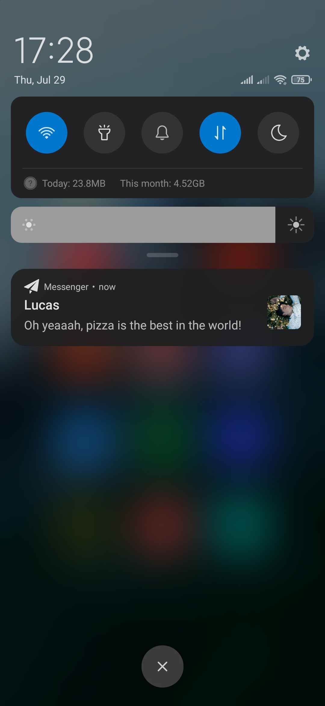

# Messenger for Android
Messenger is a simple messaging app with support for:
* Creating profile
* Editing profile
* Add photo to a profile
* Finding profiles by the tag
* Sending and receiving text messages
* Receiving push notification about new messages
* Switch between light and dark mode
### Server 
Github: https://github.com/DenysPits/OP-Messenger-Server
### Screenshots
##### Main screen:

##### Chat screen:

##### Profile editing screen:

##### Notification:

